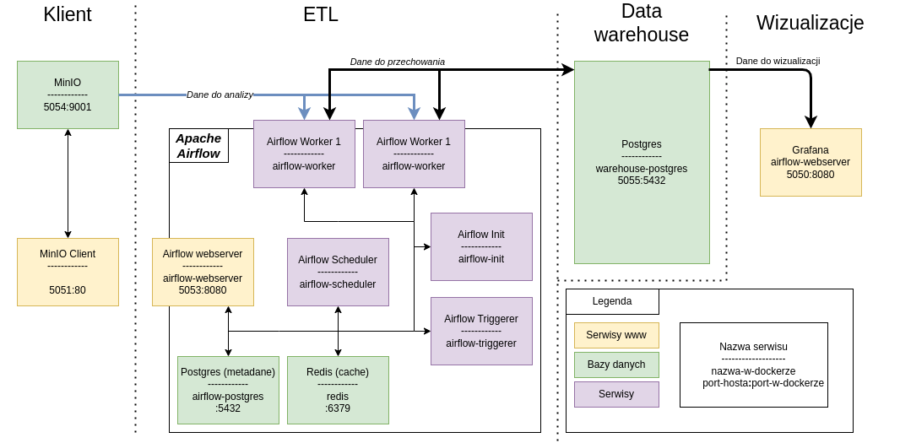

# Grafana + Airflow 

## Architectire



### Services

- [MinIO Client](http://localhost:5051)
- [Airflow Webserver](http://localhost:5053)
- [Grafana](http://localhost:5050)

## How to run

```sh
git clone git@github.com:finloop/grafana-airflow-etl.git
cd grafana-airflow-etl
docker-compose up
```

To run ETL you'll need to put data into MinIO. Depending on how you'll do it edit `plugins/operators/s3_operator` accordingly.

## Datasets

- [https://www.kaggle.com/olistbr/brazilian-ecommerce](https://www.kaggle.com/olistbr/brazilian-ecommerce)
- [https://www.kaggle.com/olistbr/marketing-funnel-olist/home](https://www.kaggle.com/olistbr/marketing-funnel-olist/home) 